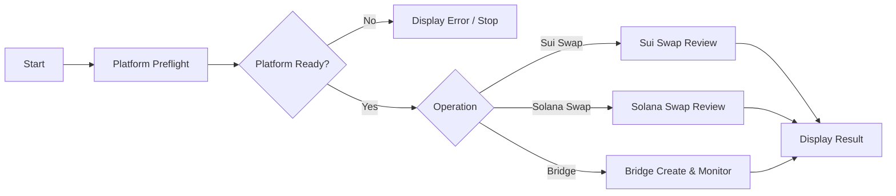
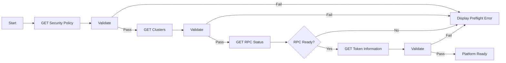
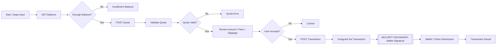
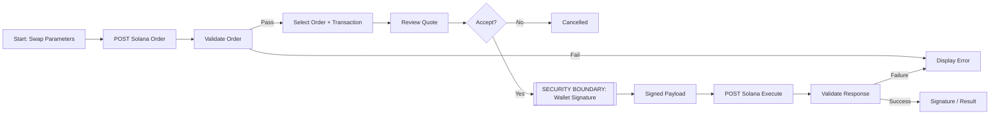
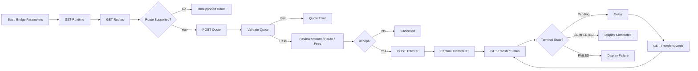

# PowerChain DeFAI Postman Flows Architecture

PowerChain uses four transaction-safe Postman workflows built from the canonical API collections. The checked-in flow manifest and Collection Runner collection provide executable request sequences; Postman Flows can then compose those same requests with visual Start, HTTP Request, Validate, Condition, Evaluate, Delay, and Display blocks.

Postman is never a wallet signer. Wallet private keys, seed phrases, treasury keys, and operator signing keys must not be placed in Postman variables.

## Production hosts

| Surface | Host |
| --- | --- |
| Shared DeFAI API | `https://powerchain.app` |
| Swap API | `https://swap.powerchain.app` |
| Bridge API | `https://bridge.powerchain.app` |

The Bridge hostname intentionally uses `powerchain`, not the earlier misspelled `powercain` value.

## Master flow



Use the master flow as the developer-facing entry point. The four checked-in workflows remain independently runnable so API testing does not require a visual canvas.

## 01 — Platform Preflight

Sequence:



Requests:

1. `GET /api/v1/security/policy`
2. `GET /api/v1/clusters`
3. `GET /api/v1/rpc/status`
4. `GET /api/v1/token/information`

The visual Flow should use Validate blocks for response shape and Condition blocks for readiness decisions. A successful preflight means the API surfaces needed by the selected operation are available; it does not authorize a transaction.

## 02 — Sui Swap

Start inputs:

| Input | Postman variable |
| --- | --- |
| Connected Sui wallet | `suiWallet` |
| Balance asset ID | `suiInputAsset` |
| Input coin type | `suiInputCoinType` |
| Output coin type | `suiOutputCoinType` |
| Amount in base units | `swapAmountBaseUnits` |
| Slippage | `slippageBps` |

Sequence:



The generated collection maps inputs to real request bodies:

```json
{
  "payer": "{{suiWallet}}",
  "fromCoinType": "{{suiInputCoinType}}",
  "toCoinType": "{{suiOutputCoinType}}",
  "amountBaseUnits": "{{swapAmountBaseUnits}}",
  "slippageBps": "{{slippageBps}}"
}
```

The quote response captures `data.minimumOutBaseUnits` into `suiMinimumOutBaseUnits`. Transaction preparation then sends that value as `minimumOutBaseUnits`, preserving the server-side minimum-output guard.

The returned transaction remains unsigned. The connected wallet signs and submits outside Postman.

## 03 — Solana / Jupiter Swap

Start inputs:

| Input | Postman variable |
| --- | --- |
| Connected Solana wallet | `solanaWallet` |
| Input mint | `solanaInputMint` |
| Output mint | `solanaOutputMint` |
| Amount in base units | `swapAmountBaseUnits` |
| Slippage | `slippageBps` |
| Wallet-signed serialized transaction | `signedTransaction` |

Sequence:



The order request captures:

- `data.requestId` → `jupiterRequestId`
- `data.transaction` → `jupiterUnsignedTransaction`
- `data.otherAmountThreshold` → `jupiterMinimumOutputBaseUnits`
- `data.lastValidBlockHeight` → `jupiterLastValidBlockHeight`

Postman does not transform `jupiterUnsignedTransaction` into `signedTransaction`. That transition belongs to the connected wallet.

## 04 — Bridge Create & Monitor

Start inputs:

| Input | Postman variable |
| --- | --- |
| Direction | `bridgeDirection` |
| Principal base units | `bridgePrincipalBaseUnits` |
| Source wallet | `bridgeSourceAddress` |
| Destination wallet | `bridgeDestinationAddress` |
| Idempotency key | `bridgeIdempotencyKey` |

Sequence:



The quote body is production-shaped:

```json
{
  "direction": "{{bridgeDirection}}",
  "principalBaseUnits": "{{bridgePrincipalBaseUnits}}",
  "sourceAddress": "{{bridgeSourceAddress}}",
  "destinationAddress": "{{bridgeDestinationAddress}}"
}
```

The quote response captures:

- `data.quoteId` → `bridgeQuoteId`
- `data.intentCommitment` → `bridgeIntentCommitment`
- `data.runtimeSnapshotId` → `bridgeRuntimeSnapshotId`

Transfer creation then binds those exact values and sends `Idempotency-Key: {{bridgeIdempotencyKey}}`.

### Canonical Bridge statuses

The visual Condition block must use statuses returned by the PowerChain API rather than invented labels:

```text
CREATED
SOURCE_SUBMITTING
SOURCE_SUBMITTED
SOURCE_FINALIZED
MESSAGE_OBSERVED
DESTINATION_SUBMITTED
DESTINATION_FINALIZED
RECONCILIATION_REQUIRED
COMPLETED
FAILED
```

`COMPLETED` and `FAILED` are terminal in the current API model. `RECONCILIATION_REQUIRED` is intentionally non-terminal and requires operational attention.

A Delay block is appropriate between status checks in the visual Postman Flow. The checked-in Collection Runner companion intentionally performs a bounded status/events pass rather than embedding an unbounded polling loop.

## Visual block mapping

| Stage | Postman Flow block |
| --- | --- |
| Start/input | Start |
| API calls | HTTP Request |
| Response contract | Validate |
| Readiness/route/terminal decision | Condition |
| Normalize/capture values | Evaluate |
| Bridge polling interval | Delay |
| Final result/error | Display |

## Security boundaries

### Wallet signing

The Sui and Solana flows stop at unsigned transaction preparation. The signing step must be visibly grouped in the Flow canvas as:

```text
SECURITY BOUNDARY
Postman does not sign wallet transactions
```

Never place private keys, seed phrases, wallet export material, treasury keys, or relayer/operator keys in Postman variables.

### Bridge settlement

A successful Postman request is not settlement proof. Bridge completion still requires the production backend's finalized chain evidence plus Wormhole NTT reconciliation. Postman, explorer data, mocks, AI responses, and market data are not authoritative for Bridge accounting.

## Checked-in artifacts

| Artifact | Purpose |
| --- | --- |
| `api/postman/flows/PowerChain-DeFAI.flows.json` | Declarative Flow architecture and typed request mapping |
| `api/postman/flows/PowerChain-DeFAI.flows.postman_collection.json` | Executable Collection Runner companion |
| `api/postman/flows/README.md` | Flow usage and security summary |
| `api/postman/API_DOCS.md` | Combined API/Postman documentation |

Regenerate and verify with:

```bash
pnpm postman:generate
pnpm postman:check
pnpm postman-lifecycle:production:check
```
